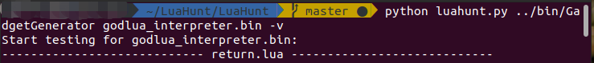

# LuaHunt

LuaHunt is a tool that can automatically analyze the customized Lua interpreter via interpreter semantics testing and deobfuscate the obfuscated bytecode.

It can extract the file format of obfuscated bytecode, and derandomize the opcode of customized Lua interpreter.

We have tested LuaHunt with GodLua, Lua in XiaoMi router, and some Lua interpreters embedded in games.

You can also use LuaHunt to test other customized Lua interpreters as long as you modify the Lua compiler to compile our LuaGadget Templates into Lua Gadgets.

## The Architecture of LuaHunt:


The architecture of LuaHunt includes three parts: File Format Extraction, Opcode Derandomization, and Deobfuscation.

### File Format Extraction
With the knowledge of the obfuscated Lua bytecode's file format, we can modify *luac* to independently generate new bytecode files that adapt to the customized interpreter.
The previous data structure reverse engineering work has demonstrated that memory access patterns reveal the layout of the input format. 
Therefore, we analyze the standard Lua interpreter's binary and identify the functions used for parsing/processing different input fields (❶).
Then, we utilize the binary diffing technique to find these functions' equivalents in the customized interpreter (❷).
The interpreter maintains an internal *struct* type to record the function's metadata information, and the binary diffing results help us locate structure members.
After that, with the information of how to load bytecode file contents to fill in the structure's members (❸), we can recover the file format's layout for the obfuscated Lua bytecode.

### Opcode Derandomization
The second step is to deal with the randomized opcode sequence.
We first design high-quality "seed" inputs, which we call "LuaGadget Templates".
Each template source file consists of a basic Lua operation (e.g., an arithmetic calculation, loading a constant, or table access) that covers one or two particular opcodes' semantics, and the operation's result is observable at run time.
With the obfuscated bytecode file format obtained from the first step, we modify *luac* to compile LuaGadget Templates into LuaGadgets that can be executed by the customized interpreter (❹).
We mutate LuaGadget's unknown opcode values to generate a set of bytecode files (❺) for the following blackbox testing: 
we execute each bytecode file with the customized interpreter (❻) and examine the output without peering into the customized interpreter's internal structures or workings; 
we can observe the expected LuaGadget output only when the mutation hits the exact opcode value (❼).
We schedule LuaGadget testing (❺ ~ ❼) in an order that attempts to minimize the total number of mutations and testing needed to find the semantics for all randomized opcodes (❽).

### Deobfuscation
After we collect the results from the above two steps, we translate the obfuscated Lua bytecode file format back to the standard Lua bytecode file format and rewrite the randomized bytecode instructions into the standard ones (❾).
Therefore, applying further program analysis, such as dynamic analysis, decompilation, and static analysis, becomes straightforward.
Please note that, given *any* obfuscated Lua bytecode files that are compatible with that customized interpreter, we are able to reproduce their original programs rapidly without going through the above two steps again.
This benefit tremendously accelerates malware analysis.
We have observed that Lua malware samples take multiple obfuscated bytecode files as different malicious function modules, and a core module will schedule and control other modules. 
Only the executable code of the interpreter is statically visible, posing a huge challenge for anti-malware scanners in the industry.
**LuaHunt** frees security professionals from the burden of manually piecing together the tedious steps of reverse engineering.

## Source Description
**GadgetGenerator**: Generate LuaGadgets from LuaGadget Templates and mutate LuaGadgets.

**LuaGadgetTemplate**: LuaGadget Templates we designed used to generate LuaGadgets.

**LuaHunt**: The main part of LuaHunt.

**GodLuaDeobfuscate**: The bytecode deobfuscator for GodLua. This is an example of how to recover file format and opcode of obfuscated bytecodes.

**Benchmark**: The benchmark for correctness evaluation.

## Requirements

Operating System: Ubuntu 20.04 LTS,

Compiler: GCC 9.3.0

Other Tools:

make,

python 2 (not compatible with python 3),

IDA Pro 7.0,

IDA-Python

## Build

Just run "make" in the root directory of LuaHunt:

```
make
```

This will build the whole LuaHunt project, and the binaries will be in the "bin" directory.

If you just want to build the Gadget Generator:

```
cd GadgetGenerator && make
```

If you just want to build the deobfuscator of GodLua:

```
cd GodLuaObfuscate && make
```

In the normal conditions, you just need to run "make" in the LuaHunt root directory, and you will get the executable LuaHunt.

## Usage

After building the LuaHunt, we can use it to test customized interpreters.

You can use LuaHunt/luahunt.py to do the entire LuaHunt test:

```
cd LuaHunt
python luahunt.py GadgetGenerator Interpreter [-v]
```

The LuaHunt will do the whole test automatically.

(Please make sure that the core dump is disabled before testing. Because the core dump is not necessary for the test, and it will greatly slow down the test speed. About how to disable core dump, please refer to LuaHunt/disable\_core\_dump.sh)

If you need the verbose information of the LuaHunt test (testing time and testing results for each LuaGadget, mutations, etc.), you can add a "-v" at the end of the command line.

For example, if you want to analyze the customized Lua interpreter of GodLua, you can run LuaHunt test like this:

```
cd LuaHunt
python luahunt.py ../bin/GadgetGenerator ../bin/godlua_interpreter.bin
```

If you want to use GodLua Deobfuscator to deobfuscate the malicious bytecode of GodLua, just use:

```
./bin/GodLuaDeobfuscate -deob BytecodeFileName
```

If you don't add the "-deob" option, it will be a modified Lua compiler that can compile Lua script into bytecode that can be executed by GodLua's customized Lua interpreter.

## Running Example

Here is an example of using LuaHunt to test GodLua5.

Command Line:




Result:


